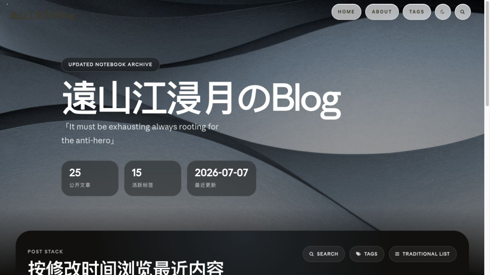
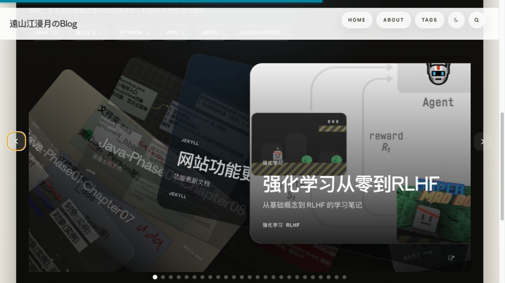
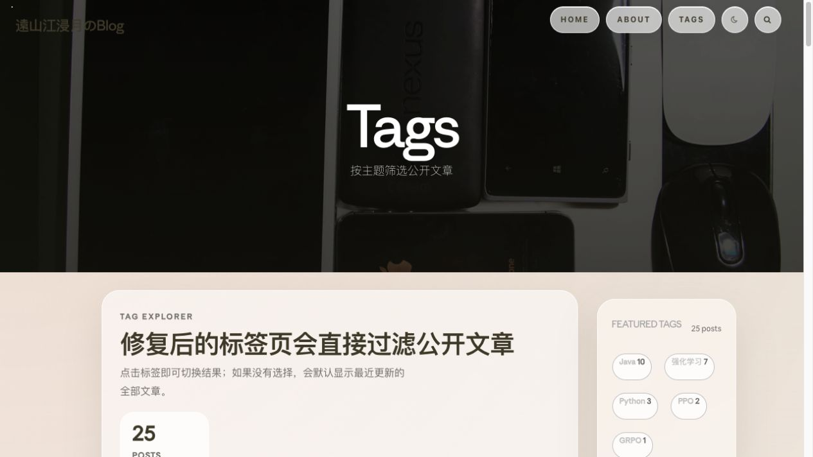
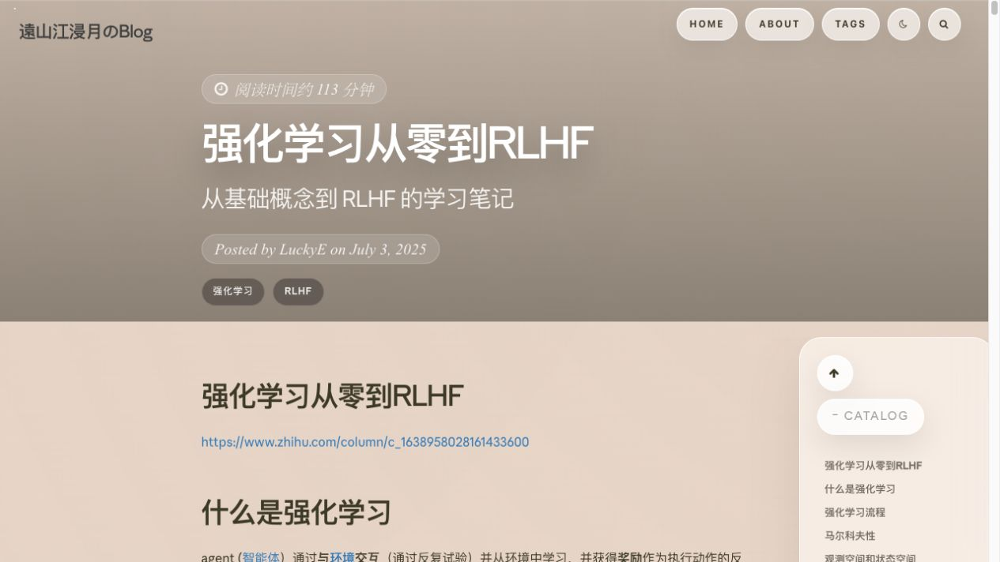
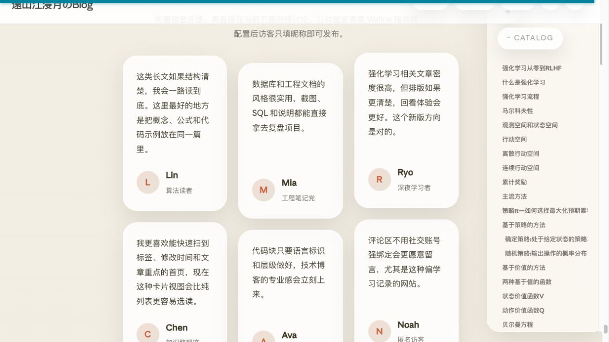

# LuckyE Blog

遠山江浸月的个人技术博客，主要记录 Java、Python、数据库、强化学习与 RLHF。站点使用 Jekyll 生成静态页面，并由 GitHub Actions 发布到 GitHub Pages。

[访问博客](https://a1024053774.github.io) · [浏览标签](https://a1024053774.github.io/tags/)

## 页面预览

### 首页与内容发现

首页现在会展示公开文章数、活跃标签和最近更新时间，并按修改时间组织内容。



文章使用纵向时间滚轮浏览：中央卡片保持清晰，上下相邻卡片形成景深；支持鼠标滚轮、触控滑动、上下方向键、右侧按钮和分页圆点，也能恢复为传统列表视图。



### 标签浏览

标签页只索引公开文章，支持按主题即时过滤，并显示每个标签对应的文章数量。选中标签后会展示精选 Hero、该主题下最新文章和真实封面卡片，下方仍保留完整文章列表。



### 阅读与讨论

文章页统一了阅读时间、文章元数据、代码块、数学公式和固定目录的视觉样式。



评论区包含精选读者反馈、快捷身份和独立的 Waline 编辑器与最新评论区域；访客只需填写昵称即可在 About 或文章页留言。



## 最近更新

本轮更新对应 2026-07-06 至 2026-07-11 的站点重构：

- 全站改为支持明暗主题的 Liquid Glass 视觉体系，统一导航、按钮、卡片、搜索层、侧栏和评论区。
- 首页新增文章统计、确定性最近更新排序、精选标签、纵向时间滚轮以及卡片/列表视图切换。
- 新增独立标签探索页；选中标签后展示精选 Hero、真实文章封面和完整结果列表，单篇主题会自动回退为单卡展示。
- 站内搜索改为卡片右侧悬浮面板；移动端使用底部面板，并支持点击外部、关闭按钮和 `Esc` 关闭后归还焦点。
- 重做文章阅读体验，包括阅读时间、代码块语言标识与复制操作、MathJax 兼容、阅读进度和固定目录。
- Waline 评论服务已接入生产环境，About 与各文章使用规范化路径隔离评论，并提供快捷身份、状态说明和静态读者反馈展示。
- 调整 Service Worker 缓存与资源版本，修复 GitHub Pages 部署后的旧资源、交互脚本和搜索层问题。
- 修复 About 页面侧栏在桌面布局中掉到正文下方的问题，并补齐移动端响应式细节。

## 21st.dev 素材与设计参考

本项目参考了以下 [21st.dev](https://21st.dev) 社区素材。由于本站是 Jekyll 项目，相关效果已改写为 Liquid 模板、Less 和原生 JavaScript，没有直接引入这些 React 组件作为运行时依赖。

| 参考素材 | 作者 | 本项目中的应用 |
| --- | --- | --- |
| [CardStack](https://21st.dev/community/components/ruixen.ui/card-stack) | Ruixen UI | 首页文章卡片的循环切换与分页状态基础，现已改为纵向时间滚轮 |
| [Testimonials Columns](https://21st.dev/community/components/efferd/testimonials-columns-1/default) | Efferd | 评论区的读者反馈标题、卡片分栏和响应式排列 |
| [LiquidGlass](https://21st.dev/community/components/manfromexistence/liquid-glass) | Man From Existence | 导航、操作按钮、内容面板及明暗主题的玻璃质感 |

上述条目用于标明视觉与交互参考来源；具体实现、内容结构和 Jekyll 适配均保存在本仓库中。各素材的使用条件以对应 21st.dev 页面及其上游项目许可为准。

## 技术栈

- Jekyll、Liquid、Kramdown
- Less、Bootstrap 3、原生 JavaScript
- Waline / Disqus 评论适配
- MathJax、PWA Service Worker
- Grunt 样式构建
- GitHub Actions、GitHub Pages

## 本地开发

环境要求：Ruby、Bundler、Node.js 和 pnpm。

```bash
bundle install --path vendor/bundle
pnpm install
pnpm run build:css
bundle exec jekyll serve
```

默认访问地址为 <http://127.0.0.1:4000/>。

仅构建静态站点：

```bash
bundle exec jekyll build
```

## 目录说明

```text
_posts/      博客文章
_layouts/    页面布局
_includes/   导航、搜索、评论等可复用片段
_plugins/    构建期文章元数据与标签索引
less/        Less 样式源码
css/         编译后的样式
js/          页面交互脚本
img/         站点与文章图片
docs/        README 截图等仓库文档资源
```

## 评论配置

评论系统配置位于 `_config.yml` 的 `comment_system`。当前使用 `provider: waline`，生产服务地址为 `https://walinecomment-cyan-one.vercel.app`；数据库连接信息只保存在 Vercel 环境变量中，不应写入本仓库。

Waline 部署需要满足以下条件：

1. Vercel 项目已配置 PostgreSQL / Neon 数据库环境变量。
2. Production Domain 可公开访问，Vercel Authentication 的 `Require Log In` 必须关闭。
3. `_config.yml` 中的 `comment_system.waline.server_url` 指向该 Production Domain。
4. 修改评论配置后重新构建并部署 GitHub Pages；如浏览器仍加载旧配置，请执行硬刷新或清理 Service Worker 缓存。

评论线程使用规范化页面路径作为键，例如 About 为 `/about`，文章为其永久链接路径，因此不同页面的评论不会互相串联。若需要回退到 Disqus，可将 `provider` 改为 `disqus` 并填写对应 shortname。

## 部署

推送到主分支后，`.github/workflows/jekyll.yml` 会安装依赖、构建站点并发布到 GitHub Pages。样式修改后应同步执行 `pnpm run build:css`，确保 `css/` 中的构建产物与 `less/` 源码一致。

## 说明

- 博客内容位于 `_posts/`，页面主要位于仓库根目录、`_layouts/` 和 `_includes/`。
- 源码中保留的第三方版权声明用于满足对应开源许可要求。
- `_site/` 是本地构建产物，不应作为手工维护的源码。
