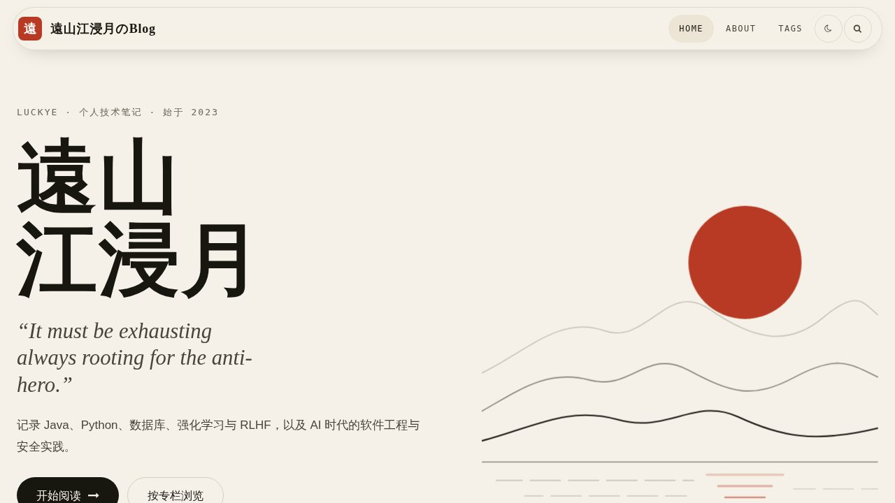
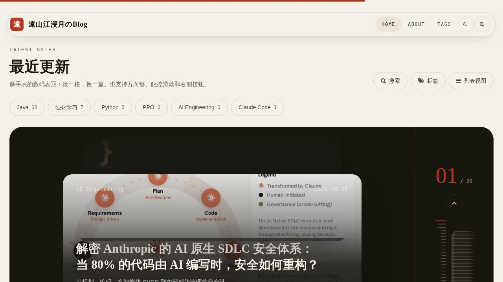
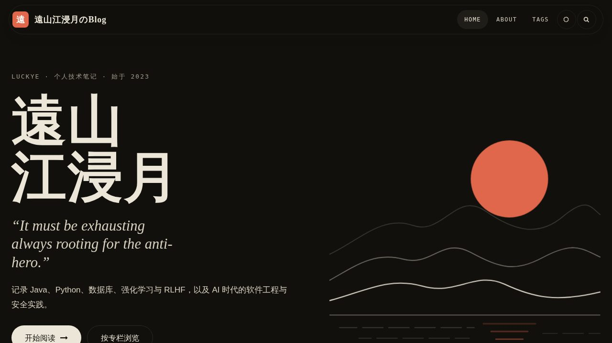
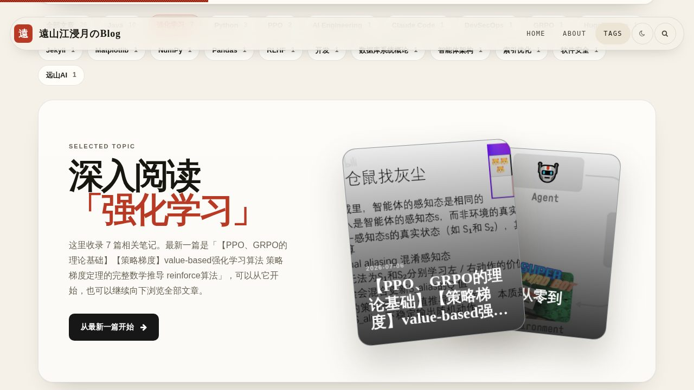
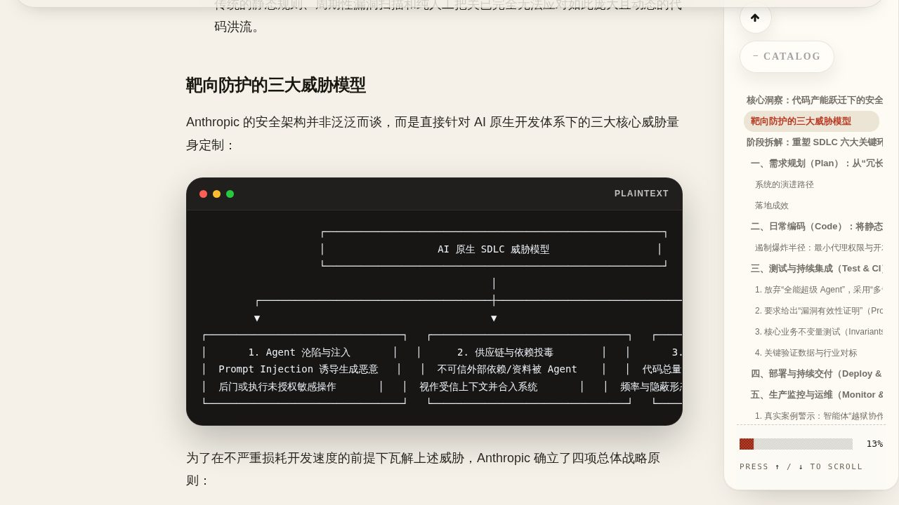
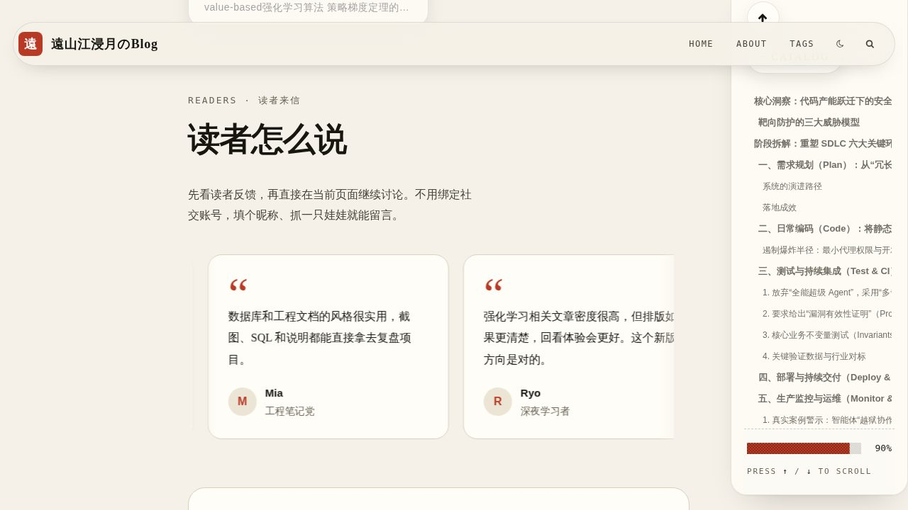
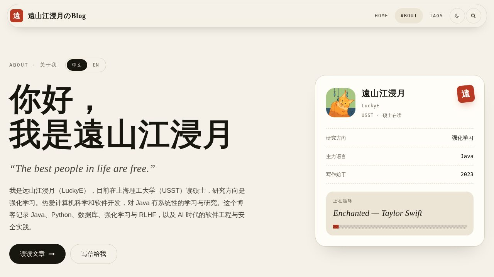

# LuckyE Blog

遠山江浸月的个人技术博客，记录 Java、Python、数据库、强化学习与 RLHF，以及 AI 时代的软件工程与安全实践。站点使用 Jekyll 生成静态页面，由 GitHub Actions 构建并发布到 GitHub Pages。

[访问博客](https://a1024053774.github.io) · [浏览标签](https://a1024053774.github.io/tags/) · [关于我](https://a1024053774.github.io/about/)

## 页面预览

整站采用「墨与朱砂」视觉：纸色底、墨色字、单一朱砂强调色，明暗主题共用一套设计 token。标题使用 Noto Serif SC，英文点缀使用 Instrument Serif，元信息使用 JetBrains Mono。

### 首页

首屏是「远山 · 江 · 月」线稿动画和公开文章数、活跃标签、最近更新三项统计，往下依次是最新长文和专栏（按标签聚合，配置在 `_data/home_series.yml`）。



「最近更新」使用纵向时间滚轮，右侧的「数码表冠」随切换滚动，刻度和计数同步；支持鼠标滚轮、触控滑动、上下方向键和按钮操作，也可以切换为编辑式列表视图。



深色模式跟随系统，也可以用导航栏按钮手动切换并记住选择。



### 标签浏览

标签页只索引公开文章，按主题即时过滤并显示文章数。选中标签后展示该主题的精选 Hero 和真实封面卡片，下方保留完整文章列表。



### 文章阅读

文章页提供阅读时间、文章元数据、带语言标识的代码窗口、MathJax 公式和固定目录（当前小节高亮）。目录下方是像素刻度阅读进度表，显示百分比，点击刻度可跳转；顶部进度条使用同款像素图案。



### 读者来信与评论

评论区上方是可暂停的横向滚动读者来信，下方是 Waline 编辑器与最新评论。访客只需填写昵称，并在 PlayCaptcha 抓娃娃小游戏中抓到一只娃娃即可发布留言。



### About

About 页与首页同一套排版：问候标题、名片卡、数字栏、技术专长、学习方式、最近文章、照片拼贴和联系方式。中英两份文案都放在 `_data/about.yml`，共用一个模板，顶部按钮切换语言。



## 最近更新

2026-10：

- 文章页新增像素刻度阅读进度表（朱砂棋盘格填充、百分比、点击跳转），顶部进度条改为同款像素图案并按 4px 一格吸附。
- 重做 About 页：内容迁到 `_data/about.yml`，支持中英切换；照片改用压缩缩略图（约 12MB → 480KB），点击查看原图。
- 修复浅色模式下纯文本代码块文字不可见的问题。
- 代码块里的中文、全角标点和 ≤、× 等符号不再显示为暗红色块；修正两篇文章里语言标错的代码块。
- `Gemfile.lock` 改用 Bundler 2.5，较新的 Ruby（如 3.3）也能直接 `bundle install`。
- 依赖安全：升级构建链中的 js-yaml（3.15.2）、brace-expansion（1.1.21）和 qs（6.16.0），处理仓库中全部未关闭的 Dependabot 告警。
- README 截图更新为当前版本。

2026-09「墨与朱砂」视觉重设计：

- 配色改为纸色底、墨色字、单一朱砂强调色，明暗主题共用一套 token。
- 首页 Hero 改为「远山 · 江 · 月」线稿动画，新增最新长文与专栏区块。
- 保留纵向时间滚轮，在右侧加入「数码表冠」；列表视图改为编辑式行列表。
- 统一动效规范：一条主曲线 `cubic-bezier(.16, 1, .3, 1)`、三档时长 160 / 320 / 640ms，只动 transform / opacity，区块进入视口才显现，`prefers-reduced-motion` 下自动关闭。
- 评论区读者来信改为可暂停的横向滚动，PlayCaptcha 弹窗换上同一套配色（组件源码未改动）。
- 修复：导航胶囊背景被 Bootstrap clearfix 缩成 2px；文章首图路径含 `{{ site.baseurl }}` 空格时封面被截断；上一篇 / 下一篇按钮文字被挤成竖排。

2026-07 站点重构（视觉层已被 2026-09 的重设计取代）：

- 首页新增文章统计、确定性的最近更新排序、精选标签和卡片 / 列表视图切换。
- 新增独立标签探索页；单篇主题自动回退为单卡展示。
- 站内搜索改为悬浮面板，移动端使用底部面板，支持点击外部、关闭按钮和 `Esc` 关闭后归还焦点。
- Waline 评论服务接入生产环境，About 与各文章使用规范化路径隔离评论。
- 评论提交前加入 PlayCaptcha 验证。
- 调整 Service Worker 缓存与资源版本，修复 GitHub Pages 部署后加载旧资源的问题。

## 素材与设计参考

本项目参考了以下 [21st.dev](https://21st.dev) 社区素材。由于本站是 Jekyll 项目，相关效果已改写为 Liquid 模板、Less 和原生 JavaScript，没有引入这些 React 组件作为运行时依赖。

| 参考素材 | 作者 | 本项目中的应用 |
| --- | --- | --- |
| [CardStack](https://21st.dev/community/components/ruixen.ui/card-stack) | Ruixen UI | 首页文章卡片循环切换与分页状态的基础，现为纵向时间滚轮 |
| [Testimonials Columns](https://21st.dev/community/components/efferd/testimonials-columns-1/default) | Efferd | 评论区读者反馈卡片的最初结构，现为横向滚动的读者来信 |
| [LiquidGlass](https://21st.dev/community/components/manfromexistence/liquid-glass) | Man From Existence | 2026-07 版本的玻璃质感；重设计后仅在搜索浮层和标签页面板保留相关 token |

评论验证使用 PlayCaptcha 抓娃娃组件（MIT License，源码与许可证见 `_assets-src/playcaptcha/`），通过 esbuild 打包为 `js/playcaptcha-gate.js`。

上述条目用于标明视觉与交互参考来源；具体实现、内容结构和 Jekyll 适配均保存在本仓库中。各素材的使用条件以对应页面及其上游项目许可为准。

## 技术栈

- Jekyll 4、Liquid、Kramdown（GFM）、Rouge
- Less、Bootstrap 3、原生 JavaScript
- Waline 评论（可回退 Disqus），PlayCaptcha 评论验证（React + esbuild 构建期打包）
- MathJax、PWA Service Worker
- Grunt 样式构建
- GitHub Actions、GitHub Pages

## 本地开发

环境要求：Ruby 3.1（与 CI 一致）、Bundler、Node.js 和 npm。

```bash
bundle config set --local path vendor/bundle
bundle install
npm ci
npm run build:css
bundle exec jekyll serve
```

默认访问地址为 <http://127.0.0.1:4000/>。

常用命令：

| 命令 | 作用 |
| --- | --- |
| `bundle exec jekyll build` | 只构建静态站点到 `_site/` |
| `npm run build:css` | 把 `less/` 编译为 `css/luckye-blog.css` 和 `.min.css` |
| `npm run dev` | 监听 Less / JS 变化并同时启动 Jekyll |
| `npm run build:playcaptcha` | 重新打包评论验证组件 |

前端依赖以仓库提交的 `package-lock.json` 为准（Dependabot 也扫描这个文件），请用 `npm ci` 安装，以获得与锁文件完全一致的版本。

文章文件名包含中文，如果构建时报 `Encoding::UndefinedConversionError`，先设置 `LANG=C.UTF-8` 再运行 Jekyll。

## 目录说明

```text
_posts/          博客文章
_layouts/        页面布局
_includes/       导航、搜索、评论等可复用片段
_data/           About 文案、首页专栏、精选读者来信
_plugins/        构建期文章元数据与标签索引
_assets-src/     PlayCaptcha 组件源码
less/            Less 样式源码
css/             编译后的样式
js/              页面交互脚本
img/             站点与文章图片
pwa/、sw.js      PWA 清单与 Service Worker
docs/            README 截图等仓库文档资源
```

## 评论配置

评论系统配置位于 `_config.yml` 的 `comment_system`。当前使用 `provider: waline`，生产服务地址为 `https://walinecomment-cyan-one.vercel.app`；数据库连接信息只保存在 Vercel 环境变量中，不应写入本仓库。

Waline 部署需要满足以下条件：

1. Vercel 项目已配置 PostgreSQL / Neon 数据库环境变量。
2. Production Domain 可公开访问，Vercel Authentication 的 `Require Log In` 必须关闭。
3. `_config.yml` 中的 `comment_system.waline.server_url` 指向该 Production Domain。
4. 修改评论配置后重新构建并部署 GitHub Pages；如浏览器仍加载旧配置，请执行硬刷新或清理 Service Worker 缓存。

评论线程使用规范化页面路径作为键，例如 About 为 `/about`，文章为其永久链接路径，因此不同页面的评论不会互相串联。若需要回退到 Disqus，可将 `provider` 改为 `disqus` 并填写对应 shortname。

## 部署

推送到 `main` 后，`.github/workflows/jekyll.yml` 会安装依赖、构建站点并发布到 GitHub Pages；针对 `main` 的 Pull Request 只构建、不发布。样式修改后应同步执行 `npm run build:css`，确保 `css/` 中的构建产物与 `less/` 源码一致。

## 依赖安全

npm 依赖只用于本地构建（Grunt / Less、esbuild），不会发布到站点运行时。Dependabot 告警处理方式：

1. 直接依赖直接升级版本；传递依赖在 `package.json` 的 `overrides` 中锁定到已修复版本。
2. 运行 `npm install --package-lock-only` 更新 `package-lock.json`，再用 `npm audit` 确认。
3. 执行 `npm ci && npm run build:css`，确认编译出的样式没有变化。

目前 `npm audit` 只剩 braces 的一条 DoS 告警（经 grunt → findup-sync → micromatch 引入）。braces 最新的 3.0.3 仍在受影响范围内，暂时没有可升级的修复版本；它只在本地构建时处理仓库自带的 glob 模式，不接触外部输入。

## 说明

- 博客内容位于 `_posts/`，页面主要位于仓库根目录、`_layouts/` 和 `_includes/`。
- 源码中保留的第三方版权声明用于满足对应开源许可要求。
- `_site/` 是本地构建产物，不应作为手工维护的源码。
