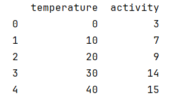

# Pandas

用Numpy创建数组,用Panda构建DataFrame,有两个参数`data`和`columns`

```python
# Create and populate a 5x2 NumPy array. 创建并填充一个 5x2 的 NumPy 数组
my_data = np.array([[0, 3], [10, 7], [20, 9], [30, 14], [40, 15]])

# Create a Python list that holds the names of the two columns.创建一个包含两列名称的 Python 列表
my_column_names = ['temperature', 'activity']

# Create a DataFrame.创建一个 DataFrame
**my_dataframe = pd.DataFrame(data=my_data, columns=my_column_names)**

# Print the entire DataFrame打印整个 DataFrame
print(my_dataframe)
```



添加列:  在原来列的基础上增加新列adjusted,值为activity列的值+2

```python
# Create a new column named adjusted.
my_dataframe["adjusted"] = my_dataframe["activity"] + 2

# Print the entire DataFrame
print(my_dataframe)
```


获取元素:

```python
print("Rows #0, #1, and #2:")
print(my_dataframe.head(3), '\n')

print("Row #2:")
print(my_dataframe.iloc[[2]], '\n')

print("Rows #1, #2, and #3:")
print(my_dataframe[1:4], '\n')

print("Column 'temperature':")
print(my_dataframe['temperature'])
#只输出温度列的第一行
print(df['temperature'][1])
```


## 读取数据集

创建一个人工数据集，并存储在CSV（逗号分隔值）文件 `../data/house_tiny.csv`中

```python
import os

os.makedirs(os.path.join('..', 'data'), exist_ok=True)
data_file = os.path.join('..', 'data', 'house_tiny.csv')
with open(data_file, 'w') as f:
    f.write('NumRooms,Alley,Price\n')  # 列名
    f.write('NA,Pave,127500\n')  # 每行表示一个数据样本
    f.write('2,NA,106000\n')
    f.write('4,NA,178100\n')
    f.write('NA,NA,140000\n')

```

### **加载原始数据集**

```python
import pandas as pd

data = pd.read_csv(data_file)
print(data)
```

### 分离输入与输出

```python
inputs, outputs = data.iloc[:, 0:2], data.iloc[:, 2] #  分离输入和输出,前两列为input，最后一列为output
inputs = inputs.fillna(inputs.mean()) # 用input的均值填充缺失值
print(inputs)
```

## **转换为张量格式**

```python
import torch
x = torch.tensor(inputs.to_numpy(dtype=float))
y = torch.tensor(outputs.to_numpy(dtype=float))
```